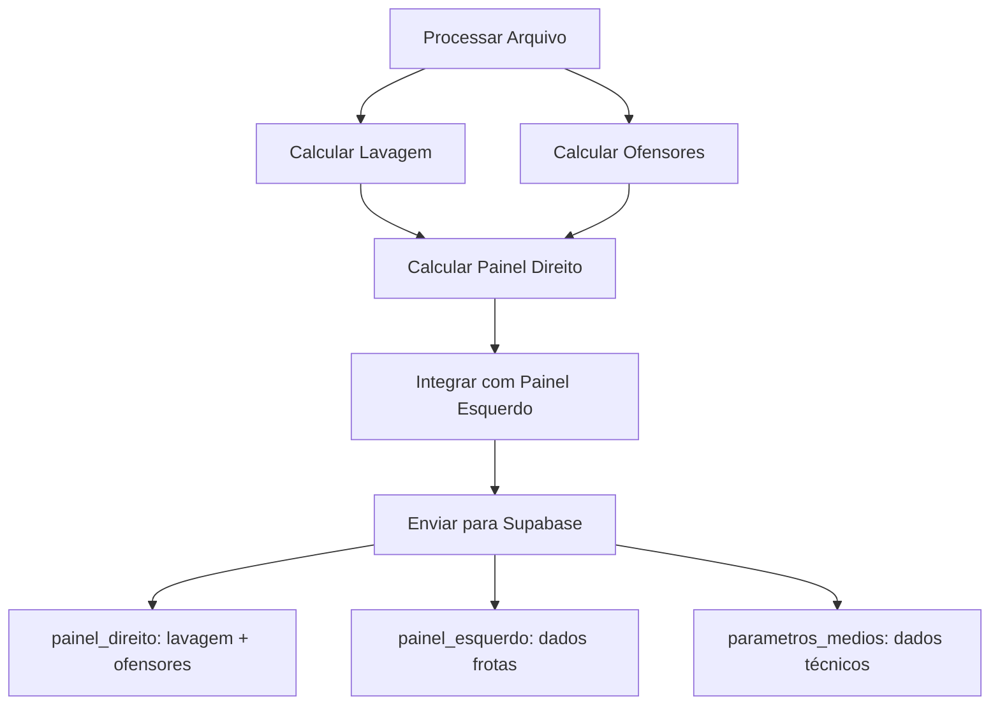

# 📊 Painel Direito - Implementação Completa

## 🎯 **Dados Implementados**

O `painel_direito` agora é enviado para o Supabase com dados das planilhas **Lavagem** e **Ofensores**.

## 📋 **Estrutura do Painel Direito**

### **Exemplo Completo do JSON Enviado**
```json
{
  "data_dia": "2025-08-07",
  "frente_id": "Frente04",
  "maquina_id": 7032,
  "parametros_medios": [...],
  "painel_esquerdo": {...},
  "painel_direito": {
    "lavagem": {
      "tem_dados": true,
      "total_intervalos": 3,
      "tempo_total_horas": 2.45,
      "equipamentos": [
        {
          "equipamento": 7032,
          "intervalos": 2,
          "tempo_total_horas": 1.5,
          "detalhes": [
            {
              "Data": "2025-08-07",
              "Equipamento": 7032,
              "Intervalo": 1,
              "Início": "08:30:00",
              "Fim": "09:15:00",
              "Duração (horas)": 0.75,
              "Tempo Total do Dia": 1.5
            },
            {
              "Data": "2025-08-07", 
              "Equipamento": 7032,
              "Intervalo": 2,
              "Início": "14:20:00",
              "Fim": "15:05:00", 
              "Duração (horas)": 0.75,
              "Tempo Total do Dia": 1.5
            }
          ]
        },
        {
          "equipamento": 7036,
          "intervalos": 1,
          "tempo_total_horas": 0.95,
          "detalhes": [...]
        }
      ]
    },
    "ofensores": [
      {
        "equipamento": 7032,
        "tempo_total": 45.5,
        "porcentagem": 35.2,
        "operacao": "Deslocamento",
        "detalhes_adicionais": "..."
      },
      {
        "equipamento": 7036,
        "tempo_total": 38.7,
        "porcentagem": 28.9,
        "operacao": "Parada Técnica", 
        "detalhes_adicionais": "..."
      }
    ]
  }
}
```

## 🧽 **Seção Lavagem**

### **Quando HÁ dados de lavagem:**
```json
{
  "lavagem": {
    "tem_dados": true,
    "total_intervalos": 5,
    "tempo_total_horas": 3.25,
    "equipamentos": [
      {
        "equipamento": 7032,
        "intervalos": 3,
        "tempo_total_horas": 2.1,
        "detalhes": [
          {
            "Data": "2025-08-07",
            "Equipamento": 7032,
            "Intervalo": 1,
            "Início": "08:30:00",
            "Fim": "09:15:00",
            "Duração (horas)": 0.75
          }
          // ... outros intervalos
        ]
      }
      // ... outros equipamentos
    ]
  }
}
```

### **Quando NÃO HÁ dados de lavagem:**
```json
{
  "lavagem": {
    "tem_dados": false,
    "total_intervalos": 0,
    "tempo_total_horas": 0,
    "equipamentos": []
  }
}
```

## ⚠️ **Seção Ofensores**

### **Estrutura dos Ofensores:**
```json
{
  "ofensores": [
    {
      "equipamento": 7032,
      "tempo_total": 45.67,
      "porcentagem_pct": 35.2,
      "operacao": "Deslocamento",
      "causa": "Manutenção preventiva"
    },
    {
      "equipamento": 7036,
      "tempo_total": 38.92,
      "porcentagem_pct": 28.7,
      "operacao": "Parada Técnica",
      "causa": "Aguardando transbordo"
    }
  ]
}
```

### **Mapeamento Automático de Colunas:**
```python
# Conversão automática de nomes de colunas
original_column = "Tempo Total (horas)"
snake_case = "tempo_total_horas"

original_column = "Porcentagem (%)"
snake_case = "porcentagem_pct"

original_column = "Operação Principal"
snake_case = "operacao_principal"
```

## 🔄 **Fluxo de Processamento**



## 🛠️ **Frontend - Como Usar**

### **React/Vue/TypeScript Example:**
```typescript
interface PainelDireito {
  lavagem: {
    tem_dados: boolean;
    total_intervalos: number;
    tempo_total_horas: number;
    equipamentos: Array<{
      equipamento: number;
      intervalos: number;
      tempo_total_horas: number;
      detalhes: Array<any>;
    }>;
  };
  ofensores: Array<{
    equipamento: number;
    [key: string]: any; // Campos dinâmicos das colunas
  }>;
}

// Uso no componente
const { painel_direito } = dadosSupabase;

// Lavagem
if (painel_direito.lavagem.tem_dados) {
  console.log(`Total de lavagens: ${painel_direito.lavagem.total_intervalos}`);
  console.log(`Tempo total: ${painel_direito.lavagem.tempo_total_horas}h`);
  
  painel_direito.lavagem.equipamentos.forEach(equip => {
    console.log(`Equipamento ${equip.equipamento}: ${equip.intervalos} lavagens`);
  });
} else {
  console.log("Nenhuma lavagem registrada");
}

// Ofensores
painel_direito.ofensores.forEach(ofensor => {
  console.log(`Top ofensor: Equipamento ${ofensor.equipamento}`);
});
```

### **Componente de Lavagem:**
```jsx
function ComponenteLavagem({ lavagem }) {
  if (!lavagem.tem_dados) {
    return <div>Nenhuma lavagem registrada hoje</div>;
  }
  
  return (
    <div>
      <h3>Lavagens do Dia</h3>
      <p>Total: {lavagem.total_intervalos} intervalos</p>
      <p>Tempo: {lavagem.tempo_total_horas.toFixed(1)}h</p>
      
      {lavagem.equipamentos.map(equip => (
        <div key={equip.equipamento}>
          <h4>Equipamento {equip.equipamento}</h4>
          <p>{equip.intervalos} lavagens ({equip.tempo_total_horas.toFixed(1)}h)</p>
          
          <table>
            <thead>
              <tr><th>Início</th><th>Fim</th><th>Duração</th></tr>
            </thead>
            <tbody>
              {equip.detalhes.map((detalhe, i) => (
                <tr key={i}>
                  <td>{detalhe['Início']}</td>
                  <td>{detalhe['Fim']}</td>
                  <td>{detalhe['Duração (horas)']}h</td>
                </tr>
              ))}
            </tbody>
          </table>
        </div>
      ))}
    </div>
  );
}
```

### **Componente de Ofensores:**
```jsx
function ComponenteOfensores({ ofensores }) {
  if (!ofensores.length) {
    return <div>Nenhum ofensor identificado</div>;
  }
  
  return (
    <div>
      <h3>Top Ofensores</h3>
      <table>
        <thead>
          <tr>
            <th>Equipamento</th>
            <th>Tempo</th>
            <th>%</th>
            <th>Operação</th>
          </tr>
        </thead>
        <tbody>
          {ofensores.map((ofensor, i) => (
            <tr key={i}>
              <td>{ofensor.equipamento}</td>
              <td>{ofensor.tempo_total?.toFixed(1)}h</td>
              <td>{ofensor.porcentagem_pct?.toFixed(1)}%</td>
              <td>{ofensor.operacao || 'N/A'}</td>
            </tr>
          ))}
        </tbody>
      </table>
    </div>
  );
}
```

## 📊 **Consultas SQL Úteis**

### **Buscar dados de lavagem:**
```sql
SELECT 
    data_dia,
    frente_id,
    painel_direito->'lavagem'->>'total_intervalos' as total_lavagens,
    painel_direito->'lavagem'->>'tempo_total_horas' as tempo_total_lavagem
FROM registros_painelmaq 
WHERE data_dia = '2025-08-07'
  AND painel_direito->'lavagem'->>'tem_dados' = 'true';
```

### **Buscar top ofensores:**
```sql
SELECT 
    data_dia,
    frente_id,
    maquina_id,
    jsonb_array_elements(painel_direito->'ofensores') as ofensor
FROM registros_painelmaq 
WHERE data_dia = '2025-08-07'
ORDER BY (jsonb_array_elements(painel_direito->'ofensores')->>'porcentagem_pct')::float DESC;
```

## ✅ **Status da Implementação**

| Componente | Status |
|------------|--------|
| **Função calcular_painel_direito** | ✅ Implementada |
| **Integração com processamento** | ✅ Integrada |
| **Envio para Supabase** | ✅ Configurado |
| **Mapeamento de lavagem** | ✅ Completo |
| **Mapeamento de ofensores** | ✅ Dinâmico |
| **Tratamento de dados vazios** | ✅ Implementado |
| **Documentação** | ✅ Completa |

## 🎉 **Resultado Final**

✅ **painel_direito** implementado com dados de **Lavagem** e **Ofensores**
✅ **Estrutura consistente** para frontend consumir
✅ **Tratamento robusto** de dados ausentes
✅ **Mapeamento dinâmico** de colunas para snake_case
✅ **Dados detalhados** de intervalos de lavagem
✅ **Top ofensores** processados automaticamente

**Status: 🟢 IMPLEMENTADO E INTEGRADO AO SUPABASE**
