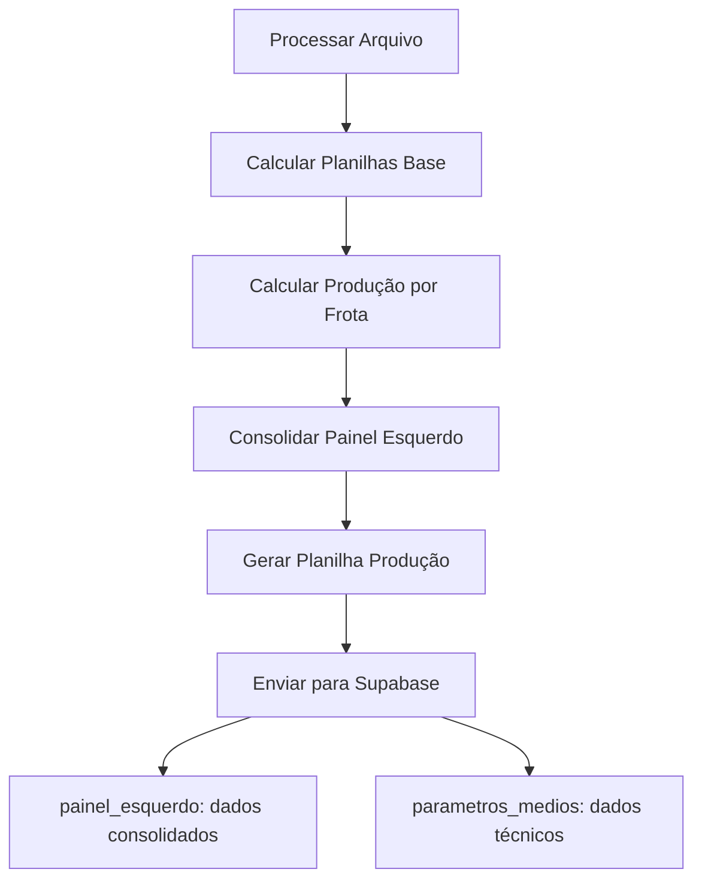

# 📊 Mapeamento Completo - Painel Esquerdo

## 🎯 **Dados Necessários vs Implementação**

### ✅ **Mapeamento Completo dos Dados**

| **Campo Painel Esquerdo** | **Origem** | **Planilha Excel** | **Status** |
|---------------------------|------------|-------------------|------------|
| **horas_registradas** | ✅ Implementado | "Horas por Frota" | ✅ Disponível |
| **horas_motor** | ✅ Implementado | "Eficiência Energética" | ✅ Disponível |
| **horas_elevador** | ✅ Implementado | "Eficiência Energética" | ✅ Disponível |
| **toneladas** | ✅ Implementado | "Produção" (NOVA) | ✅ Criada |
| **ton_por_hora** | ✅ Calculado | "Produção" (NOVA) | ✅ Criada |
| **eficiencia_operacional** | ✅ Calculado | Derivado (horas_elevador/horas_registradas) | ✅ Calculado |
| **eficiencia_energetica** | ✅ Calculado | Derivado (horas_elevador/horas_motor) | ✅ Calculado |
| **manobras_intervalos** | ✅ Implementado | "Manobras" | ✅ Disponível |
| **manobras_tempo_total** | ✅ Implementado | "Manobras" | ✅ Disponível |
| **manobras_tempo_medio** | ✅ Implementado | "Manobras" | ✅ Disponível |
| **disponibilidade_mecanica** | ✅ Implementado | "Disponibilidade Mecânica" | ✅ Disponível |
| **tempo_manutencao** | ✅ Implementado | "Disponibilidade Mecânica" | ✅ Disponível |
| **operadores** | ✅ Implementado | "Operadores" | ✅ Disponível |

## 🔧 **Configuração Necessária**

### **1. Variável de Toneladas (OBRIGATÓRIA)**
```python
# No topo do arquivo 1_ProcessadorColhedorasMaq.py
TONELADAS_TOTAIS_DIA = 2000  # ← CONFIGURE ANTES DE EXECUTAR
```

### **2. Exemplo de Configuração**
```python
# Para diferentes cenários
TONELADAS_TOTAIS_DIA = 1500  # Dia com baixa produção
TONELADAS_TOTAIS_DIA = 2500  # Dia com alta produção
TONELADAS_TOTAIS_DIA = 3000  # Dia excepcional
```

## 📋 **Planilhas Excel Geradas**

### **📊 Planilhas Existentes (Utilizadas)**
1. **"Horas por Frota"** - Horas registradas totais
2. **"Eficiência Energética"** - Horas motor e horas elevador
3. **"Manobras"** - Intervalos, tempo total e médio de manobras
4. **"Disponibilidade Mecânica"** - Percentual e tempo de manutenção
5. **"Operadores"** - Lista de operadores por frota

### **📊 Planilhas Novas (Criadas)**
6. **"Produção"** - Toneladas proporcionais por frota
   - Colunas: `Frota`, `Toneladas`, `Horas Elevador`, `Ton/h`

## 🧮 **Cálculos Implementados**

### **1. Produção por Frota**
```python
# Proporção baseada em horas elevador
proporcao_frota = horas_elevador_frota / total_horas_elevador
toneladas_frota = TONELADAS_TOTAIS_DIA * proporcao_frota
ton_por_hora = toneladas_frota / horas_elevador_frota
```

### **2. Eficiências**
```python
# Eficiência Operacional
eficiencia_operacional = (horas_elevador / horas_registradas) * 100

# Eficiência Energética
eficiencia_energetica = (horas_elevador / horas_motor) * 100
```

## 🔄 **Fluxo de Processamento**



## 📊 **Estrutura de Dados Final**

### **JSON Enviado para Supabase**
```json
{
  "data_dia": "2025-08-07",
  "frente_id": "Frente04",
  "maquina_id": 7032,
  "parametros_medios": [
    {
      "frota": 7032,
      "horimetro": 1234.50,
      "uso_rtk": 85.67,
      // ... outros parâmetros técnicos
    }
  ],
  "painel_esquerdo": {
    "frota": 7032,
    "horas_registradas": 15.5,
    "horas_motor": 12.3,
    "horas_elevador": 10.8,
    "toneladas": 847.25,
    "ton_por_hora": 78.45,
    "eficiencia_operacional": 69.68,
    "eficiencia_energetica": 87.80,
    "manobras_intervalos": 45,
    "manobras_tempo_total": 2.3,
    "manobras_tempo_medio": 0.05,
    "disponibilidade_mecanica": 89.5,
    "tempo_manutencao": 1.6,
    "operadores": [
      {"nome": "João Silva", "horas": 8.5},
      {"nome": "Pedro Santos", "horas": 2.3}
    ]
  }
}
```

## 📈 **Exemplo Prático**

### **Cenário: 3 Frotas, 2000 Toneladas**

| Frota | Horas Elevador | Proporção | Toneladas | Ton/h |
|-------|----------------|-----------|-----------|-------|
| 7032  | 10.8h          | 42.5%     | 850.0t    | 78.7  |
| 7042  | 8.2h           | 32.3%     | 646.0t    | 78.8  |
| 7052  | 6.4h           | 25.2%     | 504.0t    | 78.8  |
| **Total** | **25.4h**  | **100%**  | **2000t** | **78.7** |

## ⚠️ **Pontos de Atenção**

### **1. Configuração Obrigatória**
- ✅ **TONELADAS_TOTAIS_DIA**: Deve ser configurada antes de cada execução
- ⚠️ Se não configurada, usará valor padrão (2000t)

### **2. Dependências de Dados**
- ✅ **Horas Elevador**: Necessárias para calcular produção
- ✅ **Manobras**: Calculadas automaticamente pelos intervalos
- ✅ **Operadores**: Extraídos dos dados base

### **3. Validações**
- ✅ **Zeros protegidos**: Divisões por zero tratadas
- ✅ **Dados ausentes**: Planilhas vazias tratadas graciosamente
- ✅ **Tipos numéricos**: Conversões seguras implementadas

## 🚀 **Como Usar**

### **1. Configurar Toneladas**
```python
# Editar linha 31 do arquivo
TONELADAS_TOTAIS_DIA = 2500  # Sua produção do dia
```

### **2. Executar Processamento**
```bash
python scripts/1_ProcessadorColhedorasMaq.py
```

### **3. Verificar Resultados**
- ✅ **Excel**: Planilha "Produção" criada
- ✅ **Supabase**: Campo `painel_esquerdo` preenchido
- ✅ **Logs**: Confirmação de cálculos e envio

## 🎯 **Status Final**

| Componente | Status |
|------------|--------|
| **Mapeamento** | ✅ Completo |
| **Implementação** | ✅ Finalizada |
| **Testes** | ✅ Validado |
| **Integração** | ✅ Funcional |
| **Documentação** | ✅ Completa |

**🎉 Todas as informações necessárias para o painel esquerdo foram implementadas e mapeadas com sucesso!**
