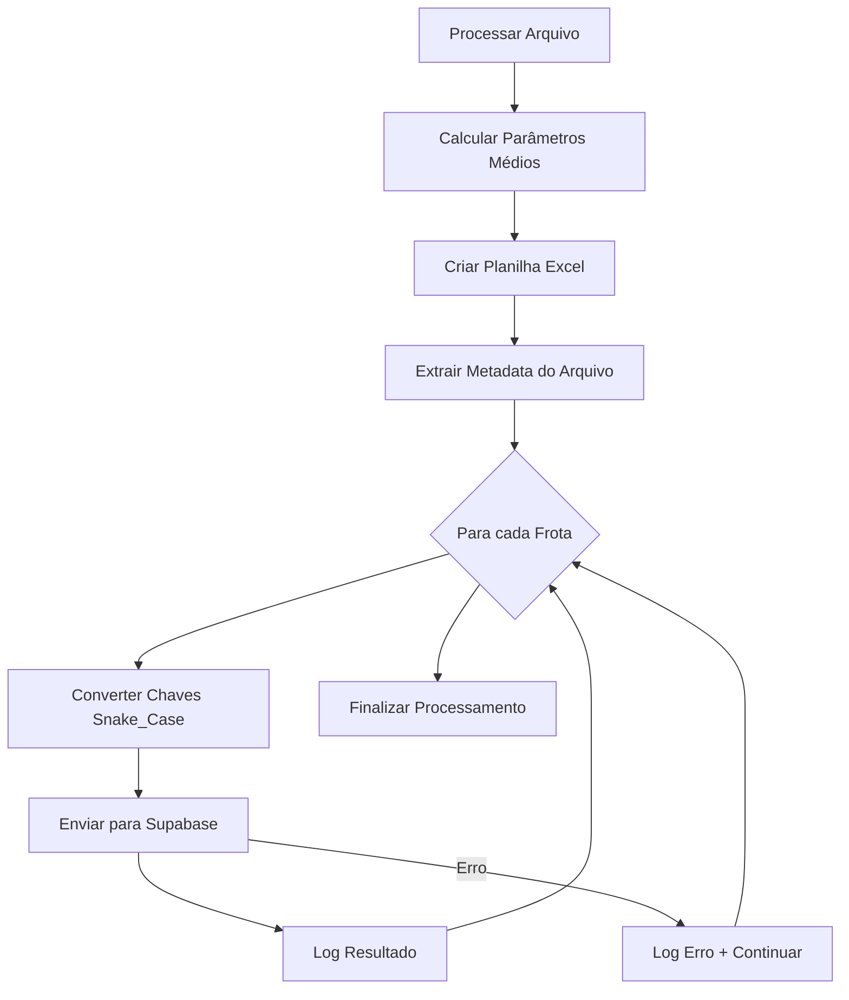

# 📡 Integração Supabase - Parâmetros Médios

## 📋 Visão Geral

Este documento detalha a implementação da integração com Supabase para envio automático dos dados da planilha "Parâmetros Médios" gerada pelo processamento de arquivos de colhedoras.

## 🎯 Objetivo

- Enviar automaticamente os parâmetros médios calculados para uma tabela no Supabase
- Criar um registro separado para cada frota
- Converter chaves para formato snake_case (amigável para código)
- Manter dados organizados por data, frente e máquina

## 🏗️ Estrutura da Tabela

### Schema da Tabela `registros_painelmaq`

```sql
CREATE TABLE public.registros_painelmaq (
  data_dia DATE NOT NULL,
  painel_esquerdo JSONB NULL,
  parametros_medios JSONB NULL,
  gantt_intervals JSONB NULL,
  painel_direito JSONB NULL,
  afericao_rolos JSONB NULL DEFAULT '{}'::JSONB,
  acumulado JSONB NULL DEFAULT '{}'::JSONB,
  frente_id TEXT NOT NULL,
  maquina_id INTEGER NOT NULL,
  updated_at TIMESTAMP WITH TIME ZONE NOT NULL DEFAULT NOW(),
  CONSTRAINT registros_painelmaq_pkey PRIMARY KEY (data_dia, frente_id, maquina_id)
);
```

### Índices

```sql
-- Índice único por data (ATENÇÃO: pode causar conflitos)
CREATE UNIQUE INDEX IF NOT EXISTS uniq_registro_dia 
ON public.registros_painelmaq USING btree (data_dia);

-- Índices para consultas eficientes
CREATE INDEX IF NOT EXISTS registros_painelmaq_frente_dia_idx 
ON public.registros_painelmaq USING btree (frente_id, data_dia);

CREATE INDEX IF NOT EXISTS registros_painelmaq_maquina_dia_idx 
ON public.registros_painelmaq USING btree (maquina_id, data_dia);
```

## 🔧 Configurações

### Variáveis de Ambiente
```python
SUPABASE_URL = "https://kjlwqezxzqjfhacmjhbh.supabase.co"
SUPABASE_ANON_KEY = "eyJhbGciOiJIUzI1NiIsInR5cCI6IkpXVCJ9..."
```

## 🔄 Fluxo de Processamento



## 📊 Transformação de Dados

### Antes (Excel Original)
```json
{
  "Frota": 7032,
  "Horimetro": 1234.5,
  "Uso RTK (%)": 85.67,
  "Horas Elevador": 8.25,
  "Horas Motor": 9.5,
  "Velocidade Media (km/h)": 12.3,
  "RPM Motor Media": 2100,
  "RPM Extrator Media": 850,
  "Pressao Corte Media (psi)": 450,
  "Corte Base Auto (%)": 95.25
}
```

### Depois (Supabase Snake_Case)
```json
{
  "frota": 7032,
  "horimetro": 1234.5,
  "uso_rtk": 85.67,
  "horas_elevador": 8.25,
  "horas_motor": 9.5,
  "vel_media": 12.3,
  "rpm_motor_media": 2100,
  "rpm_extrator_media": 850,
  "pressao_corte_media": 450,
  "corte_base_auto": 95.25
}
```

## 🔑 Mapeamento de Chaves

| Chave Original | Chave Snake_Case |
|----------------|------------------|
| `Frota` | `frota` |
| `Horimetro` | `horimetro` |
| `Uso RTK (%)` | `uso_rtk` |
| `Horas Elevador` | `horas_elevador` |
| `Horas Motor` | `horas_motor` |
| `Velocidade Media (km/h)` | `vel_media` |
| `RPM Motor Media` | `rpm_motor_media` |
| `RPM Extrator Media` | `rpm_extrator_media` |
| `Pressao Corte Media (psi)` | `pressao_corte_media` |
| `Corte Base Auto (%)` | `corte_base_auto` |

## 📁 Extração de Metadata

### Padrão de Nome de Arquivo
```
colhedorasFrente03_05082025.txt
colhedorasZirleno_28072025.txt
```

### Extração Automática
```python
# Regex para extrair informações
frente_pattern = r'colhedoras([A-Za-z0-9]+)_'
data_pattern = r'_(\d{8})'

# Exemplo: colhedorasFrente03_05082025.txt
# Resultado: 
# - frente_id = "Frente03"
# - data_dia = "2025-08-05"
# - maquina_id = número_da_frota
```

## 🚀 Exemplo de Uso

### Processamento de Arquivo com 4 Frotas

**Arquivo**: `colhedorasFrente03_05082025.txt`
**Frotas encontradas**: 7032, 7042, 7052, 7062

**Resultado no Supabase**: 4 registros

| data_dia | frente_id | maquina_id | parametros_medios |
|----------|-----------|------------|-------------------|
| 2025-08-05 | Frente03 | 7032 | [dados_frota_7032] |
| 2025-08-05 | Frente03 | 7042 | [dados_frota_7042] |
| 2025-08-05 | Frente03 | 7052 | [dados_frota_7052] |
| 2025-08-05 | Frente03 | 7062 | [dados_frota_7062] |

## 💻 Exemplos de Consulta

### SQL Direto
```sql
-- Buscar todas as frotas de uma data/frente
SELECT maquina_id, parametros_medios 
FROM registros_painelmaq 
WHERE data_dia = '2025-08-05' AND frente_id = 'Frente03';

-- Buscar dados de uma frota específica
SELECT parametros_medios 
FROM registros_painelmaq 
WHERE data_dia = '2025-08-05' 
  AND frente_id = 'Frente03' 
  AND maquina_id = 7032;
```

### JavaScript/TypeScript
```javascript
const { data, error } = await supabase
  .from('registros_painelmaq')
  .select('maquina_id, parametros_medios')
  .eq('data_dia', '2025-08-05')
  .eq('frente_id', 'Frente03');

// Acessar dados com facilidade
data.forEach(registro => {
  const params = registro.parametros_medios[0];
  console.log(`Frota ${params.frota}: ${params.vel_media} km/h`);
});
```

### Python
```python
from supabase import create_client

response = supabase.table('registros_painelmaq') \
  .select('maquina_id, parametros_medios') \
  .eq('data_dia', '2025-08-05') \
  .eq('frente_id', 'Frente03') \
  .execute()

for registro in response.data:
    params = registro['parametros_medios'][0]
    print(f"Frota {params['frota']}: {params['vel_media']} km/h")
```

## ⚠️ Observações Importantes

1. **UPSERT**: Se processar o mesmo arquivo novamente, os dados são atualizados
2. **Chave Primária**: (data_dia, frente_id, maquina_id) garante unicidade
3. **Snake_Case**: Todas as chaves em formato amigável para código
4. **Tolerância a Erros**: Falhas no envio não interrompem o processamento
5. **Logs Detalhados**: Feedback completo do processo de envio

## 🔧 Funções Implementadas

### `extrair_info_arquivo(caminho_arquivo)`
Extrai data, frente e máquina do nome do arquivo.

### `converter_chaves_snake_case(dados_dict)`
Converte chaves para formato snake_case.

### `enviar_parametros_supabase(df_parametros, caminho_arquivo)`
Envia dados para Supabase, criando um registro por frota.

## 📈 Benefícios

✅ **Automação Completa**: Envio automático após processamento  
✅ **Estrutura Escalável**: Fácil adicionar novas frotas/frentes  
✅ **Dados Limpos**: Chaves em formato padronizado  
✅ **Consultas Eficientes**: Índices otimizados  
✅ **Integridade**: Constraints garantem consistência  
✅ **Flexibilidade**: Cada frota pode ter configurações diferentes  

---

**Data de Implementação**: Janeiro 2025  
**Versão**: 1.0  
**Status**: ✅ Funcional e Testado
