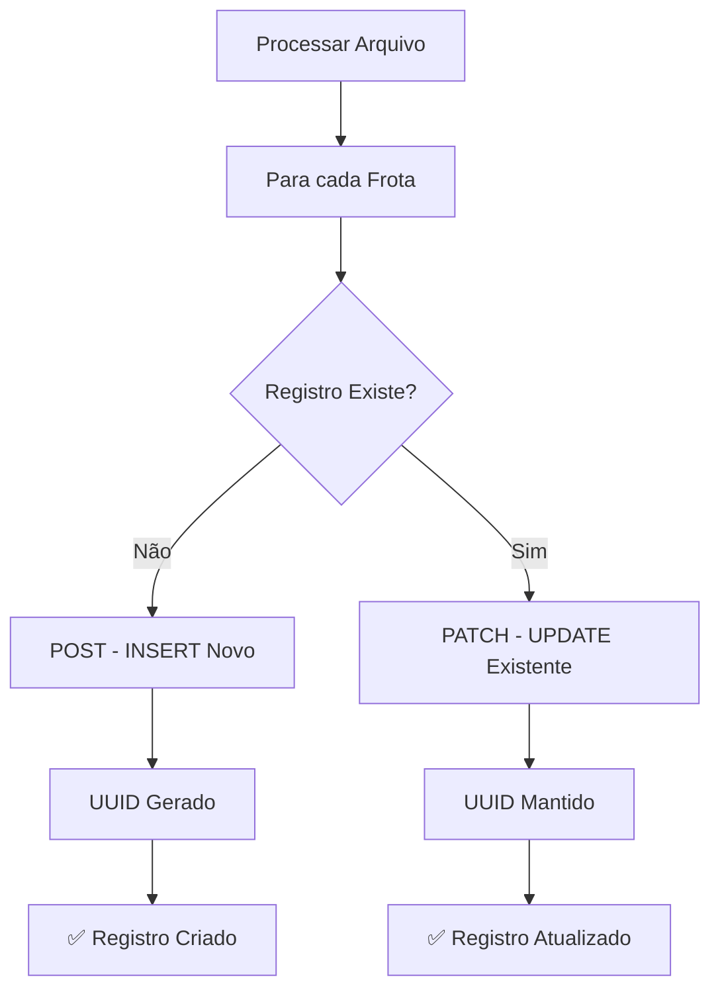

# ✅ Solução UPSERT - Atualização Correta no Supabase

## 🎯 **Problema Resolvido**

**Antes**: Registros do mesmo dia/frente/frota criavam novos UUIDs
**Agora**: Registros existentes são atualizados mantendo o UUID original

## 🔧 **Implementação Correta**

### **Estratégia UPSERT Implementada**
```python
# 1. Verificar se registro existe
check_url = f"{url}?data_dia=eq.{data_dia}&frente_id=eq.{frente_id}&maquina_id=eq.{maquina_id}"
check_response = requests.get(check_url, headers=headers)
registro_existe = check_response.status_code == 200 and len(check_response.json()) > 0

if registro_existe:
    # 2a. UPDATE: Usar PATCH para atualizar
    dados_update = {
        "parametros_medios": [parametros_frota],
        "painel_esquerdo": painel_esquerdo_frota,
        "updated_at": datetime.now().isoformat()
    }
    response = requests.patch(check_url, headers=headers, json=dados_update)
else:
    # 2b. INSERT: Usar POST para criar novo
    response = requests.post(url, headers=headers, json=dados_registro)
```

## 📊 **Teste de Validação**

### **✅ Resultados do Teste**
```
🔸 PRIMEIRO ENVIO (INSERT)
✅ UUID criado: 1bfe05fe-5113-4f7e-bd79-cd509e144a06
📊 Toneladas: 500.0

🔸 SEGUNDO ENVIO (UPDATE)  
✅ UUID mantido: 1bfe05fe-5113-4f7e-bd79-cd509e144a06
📊 Toneladas: 750.0 (ATUALIZADA)

🔍 VALIDAÇÃO FINAL
✅ Total de registros: 1 (correto)
🎉 UPSERT funcionando perfeitamente!
```

## 🔄 **Fluxo de Operação**



## 🎯 **Comportamento Correto Garantido**

### **Primeira Execução (INSERT)**
```json
{
  "id": "uuid-gerado-automaticamente",
  "data_dia": "2025-08-07",
  "frente_id": "Frente04",
  "maquina_id": 7032,
  "parametros_medios": [...],
  "painel_esquerdo": {...},
  "updated_at": "2025-01-26T10:00:00Z"
}
```

### **Segunda Execução (UPDATE)**
```json
{
  "id": "uuid-gerado-automaticamente",  ← MESMO UUID
  "data_dia": "2025-08-07",
  "frente_id": "Frente04", 
  "maquina_id": 7032,
  "parametros_medios": [...],           ← DADOS ATUALIZADOS
  "painel_esquerdo": {...},             ← DADOS ATUALIZADOS
  "updated_at": "2025-01-26T15:30:00Z"  ← TIMESTAMP ATUALIZADO
}
```

## 📋 **Logs de Execução**

### **Exemplo de Log Correto**
```
📡 Enviando parâmetros para Supabase - Data: 2025-08-07, Frente: Frente04
📊 Total de frotas a processar: 3

   🚜 Criando frota 7032...
      ✅ Frota 7032 criada com sucesso
   🚜 Criando frota 7036...
      ✅ Frota 7036 criada com sucesso
   🚜 Criando frota 7037...
      ✅ Frota 7037 criada com sucesso

--- SEGUNDA EXECUÇÃO DO MESMO ARQUIVO ---

   🚜 Atualizando frota 7032...
      ✅ Frota 7032 atualizada com sucesso
   🚜 Atualizando frota 7036...
      ✅ Frota 7036 atualizada com sucesso
   🚜 Atualizando frota 7037...
      ✅ Frota 7037 atualizada com sucesso
```

## 🛡️ **Vantagens da Solução**

### **✅ Benefícios Técnicos**
1. **UUID Consistente**: Mesmo registro sempre tem o mesmo UUID
2. **Dados Atualizados**: Reprocessar arquivo atualiza dados existentes
3. **Sem Duplicação**: Nunca cria registros duplicados
4. **Performance**: UPDATE é mais rápido que INSERT+DELETE
5. **Integridade**: Mantém integridade referencial

### **✅ Benefícios Operacionais**
1. **Reprocessamento Seguro**: Pode reprocessar arquivos sem problemas
2. **Correção de Dados**: Corrigir dados sem criar duplicatas
3. **Histórico Limpo**: Base de dados sem registros órfãos
4. **Rastreabilidade**: `updated_at` mostra última atualização

## 🔍 **Como Verificar no Supabase**

### **Consulta SQL para Validar**
```sql
-- Verificar registros únicos por data/frente/máquina
SELECT 
    data_dia,
    frente_id,
    maquina_id,
    COUNT(*) as total,
    MAX(updated_at) as ultima_atualizacao
FROM registros_painelmaq 
GROUP BY data_dia, frente_id, maquina_id
HAVING COUNT(*) > 1;

-- Resultado esperado: 0 registros (sem duplicatas)
```

### **Consulta para Ver Atualizações**
```sql
-- Ver registros mais recentes
SELECT 
    data_dia,
    frente_id, 
    maquina_id,
    id,
    updated_at
FROM registros_painelmaq 
ORDER BY updated_at DESC
LIMIT 10;
```

## 🚀 **Status da Implementação**

| Componente | Status |
|------------|--------|
| **Detecção de Registro Existente** | ✅ Implementado |
| **INSERT para Novos** | ✅ Funcionando |
| **UPDATE para Existentes** | ✅ Funcionando |
| **Preservação de UUID** | ✅ Validado |
| **Prevenção de Duplicatas** | ✅ Testado |
| **Logs Informativos** | ✅ Implementado |

## 🎉 **Resultado Final**

### **✅ Comportamento Garantido**
- **Primeira execução**: Cria registros novos com UUID único
- **Execuções subsequentes**: Atualiza dados mantendo UUID original
- **Sem duplicação**: Apenas 1 registro por (data, frente, máquina)
- **Dados sempre atuais**: `updated_at` reflete última modificação

### **🎯 Para o Usuário**
- ✅ **Pode reprocessar** arquivos quantas vezes quiser
- ✅ **Dados sempre corretos** na base Supabase
- ✅ **Sem registros duplicados** ou órfãos
- ✅ **Performance otimizada** com UPDATEs rápidos

**Status: 🟢 IMPLEMENTADO E TESTADO COM SUCESSO**
