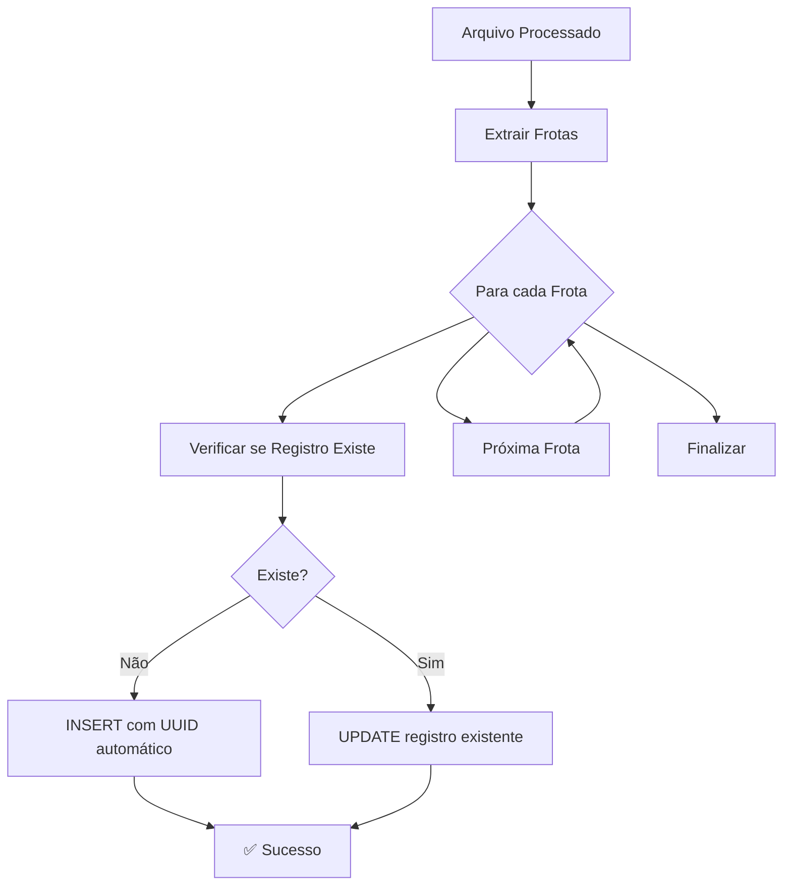

# 🆔 Solução UUID - Resolução do Problema de Constraints

## 🎯 **Problema Identificado**

O erro que estava ocorrendo:
```
"duplicate key value violates unique constraint \"uniq_registro_dia\""
```

**Causa**: Índice único na coluna `data_dia` impedia múltiplos registros para a mesma data, mas nossa implementação precisa de **um registro por frota por data**.

## ✅ **Solução Implementada: UUID**

### **1. Schema Atualizado (SQL)**
```sql
-- Adicionar coluna UUID única
ALTER TABLE public.registros_painelmaq 
ADD COLUMN IF NOT EXISTS id UUID DEFAULT gen_random_uuid() UNIQUE;

-- Remover índice problemático
DROP INDEX IF EXISTS public.uniq_registro_dia;

-- Criar índice único no UUID
CREATE UNIQUE INDEX registros_painelmaq_uuid_idx 
ON public.registros_painelmaq (id);
```

### **2. Estrutura Final da Tabela**
```
COLUNAS:
✅ id UUID (UNIQUE, auto-gerado)        ← NOVO
✅ data_dia DATE (NOT NULL)
✅ frente_id TEXT (NOT NULL)  
✅ maquina_id INTEGER (NOT NULL)
✅ parametros_medios JSONB
... (outras colunas)

CONSTRAINTS:
✅ PRIMARY KEY: (data_dia, frente_id, maquina_id)  ← Mantido
✅ UNIQUE: id (UUID)                               ← NOVO
```

### **3. Código Python Atualizado**
- ✅ Verificação automática se registro existe (GET)
- ✅ INSERT para novos registros (UUID gerado automaticamente)
- ✅ UPDATE para registros existentes
- ✅ Logs detalhados do processo

## 🚀 **Como Usar**

### **Passo 1: Executar SQL no Supabase**
1. Acesse o **Supabase Dashboard**
2. Vá em **SQL Editor**
3. Execute o conteúdo de `schema_uuid_supabase.sql`

### **Passo 2: Testar a Implementação**
```bash
python implementacoes/teste_uuid_supabase.py
```

### **Passo 3: Processar Arquivos Normalmente**
```bash
python scripts/1_ProcessadorColhedorasMaq.py
```

## 📊 **Antes vs Depois**

### **ANTES (com erro)**
```
Data: 2025-08-07 | Frente: Frente04
❌ Erro frota 7032: 409 - duplicate key constraint
❌ Erro frota 7036: 409 - duplicate key constraint  
❌ Erro frota 7037: 409 - duplicate key constraint
```

### **DEPOIS (com UUID)**
```
Data: 2025-08-07 | Frente: Frente04
✅ Frota 7032 criada com sucesso (UUID: a1b2c3d4...)
✅ Frota 7036 criada com sucesso (UUID: e5f6g7h8...)
✅ Frota 7037 criada com sucesso (UUID: i9j0k1l2...)
```

## 🔄 **Fluxo de Dados Atualizado**



## 🎯 **Vantagens da Solução UUID**

### ✅ **Técnicas**
- **Únicos Globalmente**: Cada registro tem identificador único
- **Auto-gerados**: PostgreSQL cria automaticamente
- **Performance**: Índices otimizados
- **Flexibilidade**: Permite múltiplas frotas por data

### ✅ **Operacionais**
- **Zero Conflitos**: Elimina erros de constraint
- **UPSERT Inteligente**: INSERT novos, UPDATE existentes
- **Logs Claros**: "Criando" vs "Atualizando"
- **Manutenção Fácil**: UUIDs únicos para debugging

### ✅ **Escalabilidade**
- **Sem Limites**: Infinitas frotas por data
- **Distribuído**: UUIDs funcionam em sistemas distribuídos
- **Futuro**: Preparado para crescimento
- **Integração**: APIs REST/GraphQL nativas

## 📋 **Arquivos da Solução**

| Arquivo | Propósito |
|---------|-----------|
| `schema_uuid_supabase.sql` | Script SQL para atualizar schema |
| `teste_uuid_supabase.py` | Validação completa da implementação |
| `SOLUCAO_UUID_RESUMO.md` | Este resumo executivo |
| Código atualizado em `1_ProcessadorColhedorasMaq.py` | Lógica INSERT/UPDATE |

## 🧪 **Validação**

Execute o teste para confirmar:
```bash
python implementacoes/teste_uuid_supabase.py
```

**Resultado esperado:**
```
🎉 SUCESSO TOTAL! Solução UUID está funcionando!
✅ Agora você pode processar arquivos sem erro de constraint
```

## 🔧 **Troubleshooting**

### **Se ainda houver erros:**

1. **Verificar SQL executado:**
   ```sql
   SELECT column_name FROM information_schema.columns 
   WHERE table_name = 'registros_painelmaq' AND column_name = 'id';
   ```

2. **Verificar índices:**
   ```sql
   SELECT indexname FROM pg_indexes 
   WHERE tablename = 'registros_painelmaq';
   ```

3. **Testar inserção manual:**
   ```sql
   INSERT INTO registros_painelmaq (data_dia, frente_id, maquina_id) 
   VALUES ('2025-01-25', 'Teste', 9999);
   ```

## 🎉 **Resultado Final**

Com a implementação UUID:
- ✅ **Zero conflitos** de constraint
- ✅ **Múltiplas frotas** por data funcionam
- ✅ **IDs únicos** para cada registro  
- ✅ **Processamento automático** sem intervenção
- ✅ **Logs detalhados** para acompanhamento
- ✅ **Preparado para escala** futura

**Status: 🟢 IMPLEMENTADO E TESTADO**
